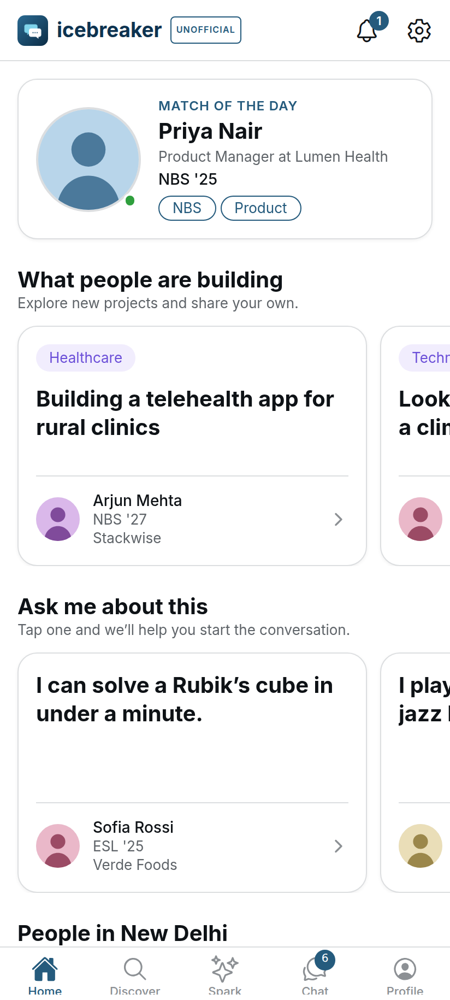
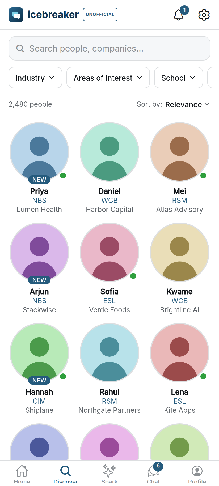
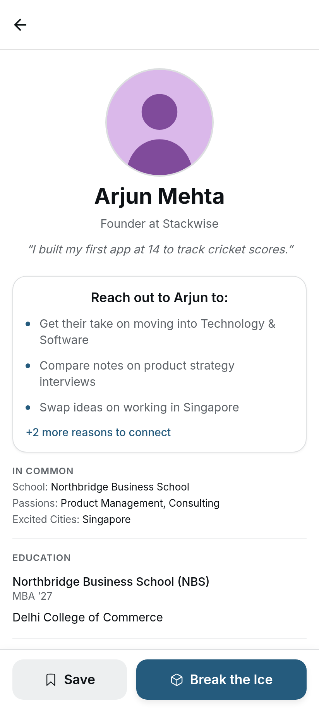
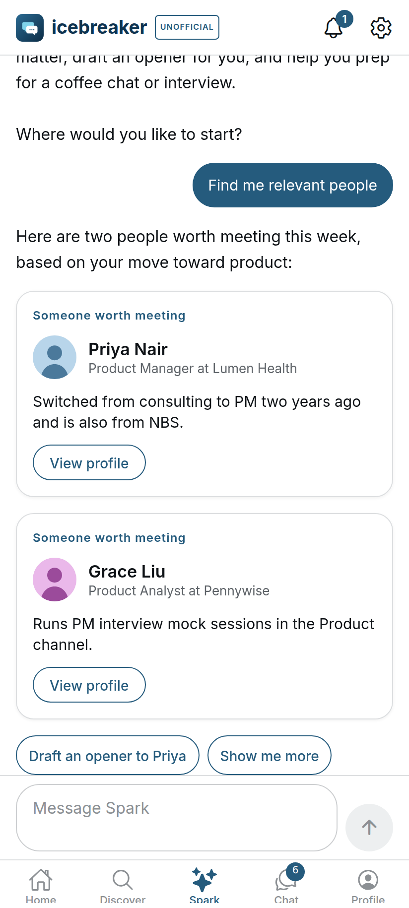

<p align="center"></p>

<h1 align="center">Icebreaker — unofficial Android app</h1>

<p align="center"><b>A product-management case study:</b> auditing a web product, specifying a mobile MVP, and shipping a working Android app (v1.0.0) on React Native + Expo.</p>

> **Disclaimer.** This is an independent, unofficial portfolio project. It is **not affiliated with, endorsed by or sponsored by Icebreaker Connect, Inc.** “Icebreaker” is used only to describe the service this client connects to. The app uses its own icon and wordmark, contains no Icebreaker artwork, and users sign in with their own existing account. Screenshots use fictional demo data.

<p align="center">




</p>

**▶ Live demo (no install, no account):** https://itsrog97.github.io/ice-breaker-unofficial-app/ — the app's own code running in the browser in a phone frame, on fictional demo data.

**📦 Download:** the APK and the design-review PDF are attached to the [v1.0.0 release](../../releases/tag/v1.0.0) (Android 7.0+, arm64 phones; side-load, test-key signed).

---

## The case study

### Problem
Icebreaker is an MBA networking product that ships as a responsive website. On phones, the core loop — *find someone relevant → understand why to talk → start a conversation → keep up with replies* — means fighting a desktop-first layout, a hamburger menu and browser sessions. **Goal:** validate whether a native, mobile-first experience could make that loop faster, without any backend changes.

### Approach
| Phase | What I did | Output |
|---|---|---|
| 1. Discovery & audit | Walked every screen of the live product as a member at phone, tablet and desktop sizes; mapped navigation, states and behaviour; inventoried every feature | [Website audit](docs/website-audit.md) — 13 routes, ~30 features ranked P0–P3 |
| 2. Product spec | Defined MVP vs Phase 2 vs Future using the feature priorities; set non-functional requirements (security, resilience, accessibility) | [Mobile product spec](docs/mobile-product-spec.md) |
| 3. UX design | Re-designed navigation and patterns for one-handed use; built a design system from the site's own tokens | [User flows](docs/user-flows.md), [Design system](docs/design-system.md), [Design review PDF](docs/design-review/) |
| 4. Build | React Native + Expo + TypeScript; secure session handling; streaming AI chat | 17 screens, 45 automated tests, [live web demo](https://itsrog97.github.io/ice-breaker-unofficial-app/) |
| 5. QA & iteration | Automated tests, scripted walkthroughs against the live service, failure-mode testing, 5 screen sizes | [QA report](docs/qa-report.md), [Changelog](CHANGELOG.md) |

### Key product decisions
| Decision | Why |
|---|---|
| **Bottom tab bar** (Home · Discover · Spark · Chat · Profile) instead of the web's side menu | Thumb reach; unread badge always visible; standard Android pattern |
| **Bottom-sheet filters** instead of dropdowns | 48 dp touch targets, searchable long lists, closes with Android back |
| **Full-screen profile with sticky “Break the Ice”** | The primary action is always one tap away while reading |
| **Reuse the existing backend, no server work** | Fastest path to validate the mobile hypothesis; risk noted in [backend integration](docs/backend-integration.md) |
| **Defer** profile editing, threads, reactions, media, push | Highest effort / lowest impact on the core loop — Phase 2 after validation |
| **Design for failure** (offline banner, retries, empty/error states everywhere) | The audit measured a 6–14 s home feed and intermittent 5xx errors |

### Scope delivered in v1.0.0
Login & secure session · Home feed · Discover (search, 5 filters, sort, infinite scroll) · Person profile + Break the Ice · Chat (channels + direct messages) · Spark AI assistant (streaming) · Notifications · My Profile · Settings (dark mode, change password) · tablet & Chromebook layouts.

### What I'd measure next
Time from app open → first message sent · % of profile views that convert to “Break the Ice” · D7 retention of mobile vs web users · reply rate within 24 h · crash-free sessions.

### What I'd do next
Push notifications (biggest expected lift for reply rate) → native profile editing → AI reply helpers → Play Store beta.

### How it was built
Product direction, scoping and review by me; implementation pair-programmed with an AI coding assistant (Claude Code). All work is documented in this repo.

---

## Repository guide
| Path | Contents |
|---|---|
| `src/` | App source (Expo Router screens, components, API client, theme) |
| `__tests__/` | Unit & component tests |
| `docs/` | Audit, product spec, user flows, data model, backend integration, design system, QA report |
| `docs/design-review/` | 28-page UI/UX review PDF, per-screen screenshots and wireframes |
| `src/demo/` | In-browser fake backend with fictional data that powers the public web demo |
| `web-demo/` | Landing page for the GitHub Pages demo (phone frame + links) |

## Tech stack
React Native 0.86 · Expo SDK 57 · Expo Router · TypeScript (strict) · TanStack Query · expo-secure-store · expo-image · Jest + React Native Testing Library

## Prerequisites
- Node.js 20+ (tested with 22) and npm
- For native Android builds: JDK 17–21, Android SDK (platform 36, build-tools 36), `ANDROID_HOME` set. Android Studio is optional.

## Install & run
```bash
npm install
npx expo start            # dev server; press "a" for a connected Android device/emulator
npm run android           # = npx expo run:android (builds & installs a dev build)
npx expo start --web      # quick browser preview (see note below)
```
Note: the web preview is for development only. Browsers block the API's cross-origin requests from `localhost`, and tokens are kept in memory on web (a page reload signs you out).

## Tests & checks
```bash
npm test                  # Jest (45 tests)
npm run typecheck         # tsc --noEmit
npm run lint              # expo lint
npx expo-doctor           # dependency/config health
```

## Web demo (GitHub Pages)
```bash
npm run build:web-demo    # EXPO_PUBLIC_DEMO_MODE=1, served from /ice-breaker-unofficial-app/app
```
Demo mode swaps the network layer for `src/demo/demoFetch.ts`, an in-memory fake backend with fictional people, chats and streamed Spark replies, so anyone can try every screen without an account. The Pages site is `web-demo/index.html` at the root plus the export in `app/` (and a copy of its `index.html` as `404.html` for deep links). The Android build never enables demo mode.

## Build an APK (test build)
```bash
npx expo prebuild --platform android --clean     # generates ./android (git-ignored)
cd android
./gradlew assembleRelease -PreactNativeArchitectures=arm64-v8a,armeabi-v7a,x86_64
# → android/app/build/outputs/apk/release/app-release.apk
# Phones only (smaller, ~25 MiB): -PreactNativeArchitectures=arm64-v8a
```
Without `android/keystore.properties` the release APK is signed with the **debug key** — fine for side-loading test builds, not for the Play Store.

## Build an AAB (Google Play)
1. Create an upload key once (keep it and its passwords safe — never commit them):
   ```bash
   keytool -genkeypair -v -keystore ~/keys/icebreaker-upload.keystore -alias upload -keyalg RSA -keysize 2048 -validity 10000
   ```
2. After `npx expo prebuild`, create `android/keystore.properties` (git-ignored):
   ```properties
   storeFile=/home/you/keys/icebreaker-upload.keystore
   storePassword=…
   keyAlias=upload
   keyPassword=…
   ```
3. `cd android && ./gradlew bundleRelease` → `android/app/build/outputs/bundle/release/app-release.aab`
4. Bump `expo.version` and `expo.android.versionCode` in `app.json` for every upload.

Alternatively use EAS Build (`npx eas-cli@latest build -p android`), which manages keys in the cloud.

## Environment variables
| Variable | Default | Purpose |
|---|---|---|
| `EXPO_PUBLIC_API_BASE_URL` | `https://joinicebreaker.com` | Backend origin (e.g. a staging server) |

Copy `.env.example` to `.env.local` to override. `EXPO_PUBLIC_*` values are compiled into the app — **never put secrets or credentials in them**.

## Secure credential handling
- There are **no credentials in this repository**. Users sign in interactively in the app.
- The password is sent once over HTTPS to sign in and is never stored.
- The returned access/refresh tokens are stored only in **expo-secure-store** (Android Keystore-backed encryption; iOS Keychain), with `AFTER_FIRST_UNLOCK_THIS_DEVICE_ONLY`. `android:allowBackup` is disabled.
- Tokens are sent only in the `Authorization` header (`credentials: 'omit'`, no cookies) and are never logged.
- On logout or a rejected refresh, tokens are deleted and all cached data is cleared.
- `.gitignore` excludes `.env*`, keystores, `keystore.properties`, `credentials.json`, APK/AAB files.

## Known limitations (v1.0)
See `docs/qa-report.md` for the full list. Highlights: no push notifications yet; profile editing, threads, reactions, media posting and AI reply helpers open/remain on the website; on-device testing so far is a single author pass; see the QA report for what was and wasn't verified.
