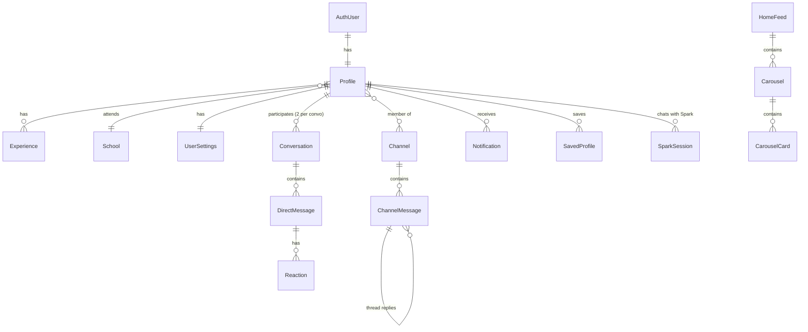

# Data Model (overview)

The main entities the app works with, as observed while using the website as a member. Field-level schemas of the (private) backend are intentionally not published; the typed models the app uses live in `src/types/api.ts`.

| Entity | What it represents | Key attributes used in the UI |
|---|---|---|
| Account / session | The signed-in member | email, verified flag; session tokens kept in the OS keystore |
| Profile | A member (you or someone else) | name, photo, headline (title at company), MBA school + class year, location, icebreaker quote, goals, passions, cities of interest, advice they give, background tags, hobbies, experience, "active" and "new" flags |
| Experience | A role on a profile | company, title, years, current flag |
| School | MBA programme | name, short alias |
| Commonalities | Why two members should talk | shared items by category; generated "reasons to connect" |
| Home feed | Personalised start page | match of the day; carousels of profile, project or icebreaker cards |
| Conversation | A 1-to-1 chat | other member, last message + time, unread count |
| Direct message | One chat message | sender, text, time, read/edited/deleted state, reactions |
| Channel | Group chat by interest | name, emoji, member count, joined flag, unread count |
| Channel message | One channel post | sender, text, time, reactions, link preview, media, thread reply count |
| Notification | Activity alert | type, actor name/photo, link target, read state, time |
| Settings | Account preferences | email notifications, theme (system/light/dark) |
| Spark session | AI assistant conversation | history of user/assistant messages; streamed replies and structured cards |
| Saved profile | Bookmark of a member | — |
