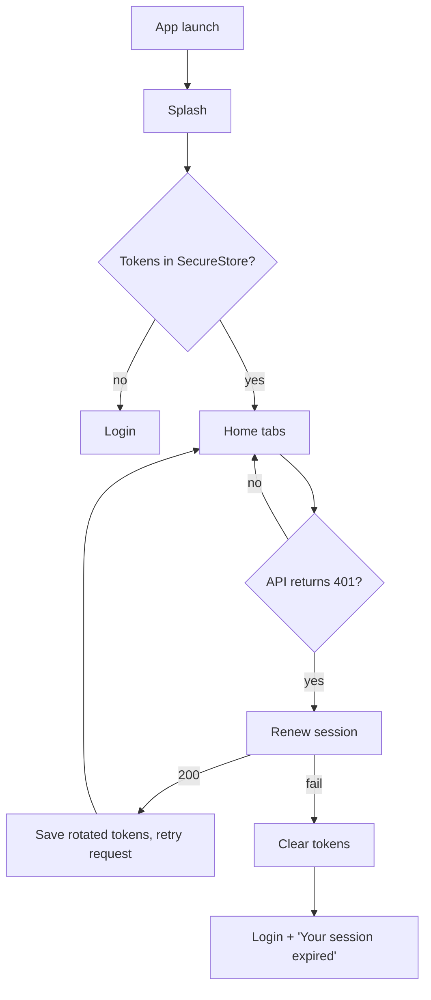
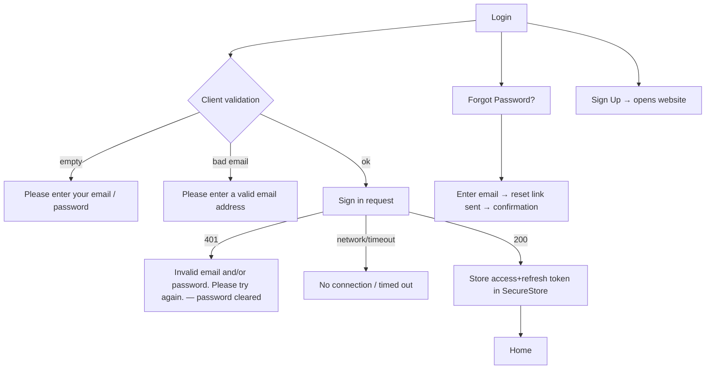
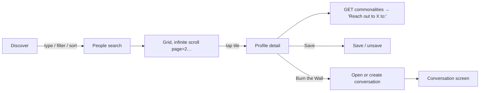
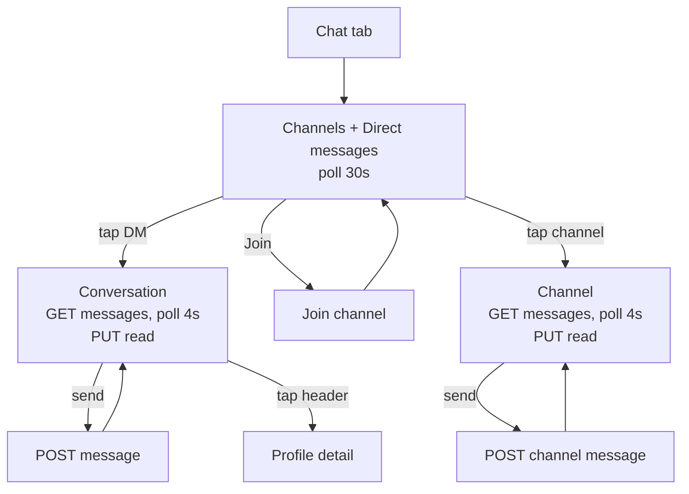
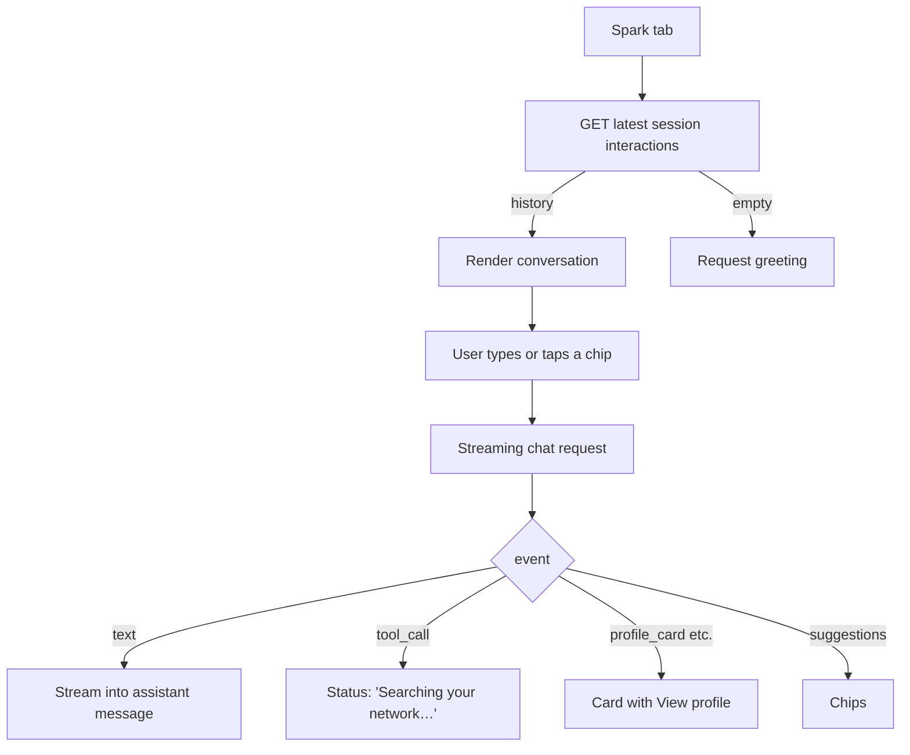

# User Flows

Flows as implemented in the Android test build (v0.1.0), mirroring the website's behaviour.

## 1. Launch & session restore

## 2. Login

## 3. Discover → Burn the Wall

## 4. Messaging

## 5. Spark

## 6. Notifications
Bell (badge = unread count, polled 30 s) → list → tap → mark read + navigate to conversation (if `conversation_id`/deep link) or sender profile. "Mark all read" in header.

## 7. Settings & logout
Header ⚙ → Settings: Email notifications toggle (PATCH), Dark mode (local + PATCH `theme_preference`), Change Password (validate → POST → re-signin), Terms/Privacy/Support (in-app browser), **Log Out** (confirm → server sign-out → clear SecureStore → Login). Android back from Login after logout exits the app — protected screens are removed from history.

## Android back button
- Tabs: back from a non-Home tab returns to Home (React Navigation `firstRoute` behaviour); back on Home exits the app.
- Stack screens (Profile detail, Conversation, Channel, Notifications, Settings, Change Password): back pops one level.
- Bottom sheets (Discover filters): back closes the sheet (`onRequestClose`).
